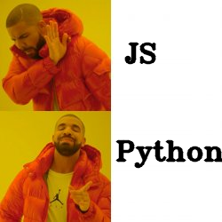

# Golem Meme Maker App

This application is a fun attempt to showcase possibilies of Golem by creating memes from templates

## Demo

Using the following template


And running the `python3 main.py drake.jpg 140,70,"VPS" 130,180,"Golem"` command below


Received result (meme) looks like the following



## Setup

Prerequisites:

- Python 3.6 or higher
- (optional) Fresh virtual environment
- Yagna daemon running ([docs](https://handbook.golem.network/requestor-tutorials/flash-tutorial-of-requestor-development))

Install packages

```
$ python3 -m pip install -r requirements.txt
```

## Run

To execute the whole example, run the following command

```
$ python3 main.py <template> <texts>
```

Where `<template>` is a path to meme template and texts being a space-separated list of texts to input, in a form of `x,y,text`.

For example, in the demo, arguments used were:

- For `<template>` - relative path to image available in the repo - `drake.jpg`
- For `<texts` - space-separated list of two texts to be inserted, one 140px from lext and 70px from top with text `VPS`, and the other 130px from left and 180px from top with text `Golem` - `140,70,VPS 130,180,Golem`

Full command to execute the demo is shown below

```
$ python3 main.py drake.jpg 140,70,"VPS" 130,180,"Golem"
```

The **main.py** file configures Golem network and deploys the task to the workers (stored in the **task.py**)

